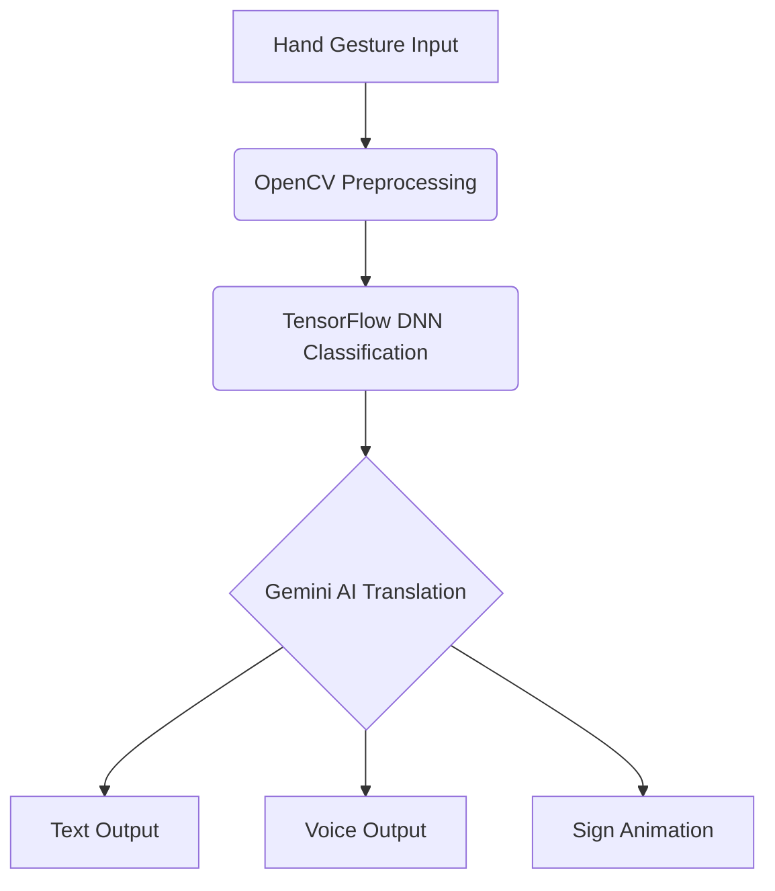

# 👐 SignComm – AI-Powered Sign Language Translator
      

> **Bridging Silence with Intelligence**
> SignComm is an AI-driven real-time sign language translator designed to break down the communication barriers faced by the deaf and mute community. By combining **computer vision, deep learning, and generative AI**, it enables seamless two-way communication between signers and non-signers.


## 💡 Inspiration

Imagine standing in a classroom, hospital, or job interview and being unable to express yourself because no one understands sign language. Millions experience this every day.

SignComm was born out of a simple yet powerful idea: **What if AI could serve as the universal interpreter, enabling the deaf and mute to be heard—instantly, everywhere?**

---

## 🚨 The Problem

* Over **70 million people** worldwide use sign language as their primary means of communication.
* Less than **1% of the global population** understands it.
* Hiring interpreters is **expensive and limited**.
* Existing solutions are either hardware-heavy, inaccurate, or non-scalable.

This results in a **Communication Divide**—barriers in education, healthcare, employment, and social participation.

---

## 🌍 Our Solution – SignComm

**SignComm** is a real-time, AI-powered translator that:

* Detects **hand gestures** via webcam.
* Converts signs into **text and speech**.
* Translates voice back into **sign animations**.
* Supports **multi-language translation** with contextual accuracy using Gemini AI.

It’s **low-cost, scalable, and accessible**—a bridge that empowers communication without boundaries.

---

## 🚀 Tech Stack

### 🔧 Core Technologies

| Technology           | Role                                                    |
| -------------------- | ------------------------------------------------------- |
| **HTML, CSS, JS**    | Frontend interface for accessibility and responsiveness |
| **Flask**            | Backend framework to serve ML models                    |
| **TensorFlow (DNN)** | Deep learning models for gesture recognition            |
| **OpenCV**           | Real-time image capture & preprocessing                 |
| **Firebase**         | Authentication & user data storage                      |
| **Gemini AI**        | Contextual translation and multi-language refinement    |

---

## 🌟 Features

✅ **Real-Time Gesture Recognition** – Instant sign-to-text conversion via webcam
✅ **Speech-to-Sign** – Converts spoken language into sign animations
✅ **Multi-Language Support** – Translate into English, Tamil, Hindi, and more
✅ **Custom Gesture Library** – Add & train new gestures for flexibility
✅ **Lightweight & Low-Cost** – Runs on basic devices without specialized hardware

---

## 🧠 How It Works

1. **Capture** – User’s hand signs are captured via webcam.
2. **Preprocess** – OpenCV filters and extracts key features.
3. **Classify** – TensorFlow DNN model predicts the gesture.
4. **Translate** – Gemini AI enhances contextual meaning and supports multiple languages.
5. **Output** – Translated result is shown as **text, speech, or animation**.



---

## 🖼️ Screenshots


---

## 🧪 Run Locally

1. Clone the repository

   ```bash
   git clone https://github.com/Phoenixarjun/SignComm
   cd SignComm
   ```

2. Install dependencies

   ```bash
   pip install -r requirements.txt
   ```

3. Add credentials

   ```bash
   FIREBASE_API_KEY=your_key
   GEMINI_API_KEY=your_key
   ```

4. Start server

   ```bash
   python app.py
   ```

5. Open `index.html` in your browser 🎉

---

## 📊 Impact & Future Scope

🔹 **Impact**

* Makes education, healthcare, and workplaces inclusive
* Reduces reliance on interpreters
* Scales across regions with multilingual adaptability

🔹 **Future Scope**

* **Mobile App** with offline mode
* **AR/VR gloves** for more natural sign capture
* **Integration with wearables** (smart glasses for subtitles)
* **Global Sign Database** with community-driven expansion
* Alignment with **UN SDG #10 – Reduced Inequalities**

---

## 👨‍💻 Author

**Naresh B A** | 💻 Full Stack & AI/ML Enthusiast | 🚀 Innovator

* 🌐 [Portfolio](https://naresh-portfolio-007.netlify.app/)
* 💼 [LinkedIn](www.linkedin.com/in/naresh-b-a-1b5331243)

---

## ⚡ Closing Note

> *“SignComm is more than technology it’s empathy coded into algorithms.
> We’re not just translating signs; we’re amplifying voices.”*


